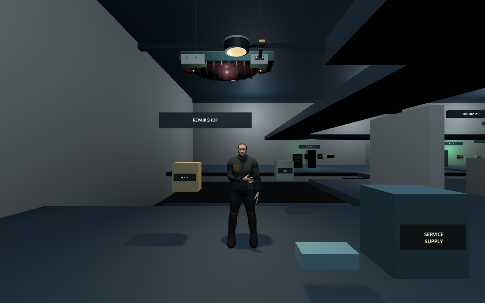

# Emergence — early feedback build

An original first-person immersive sim set in a strange cyberpunk market. Find a way through to transit, talk to its residents, and experiment with the physical systems around you.

**[Download the feedback build](https://github.com/krisciu/emergence-playtest/releases/tag/feedback-001)** · [Play guide](PLAY-GUIDE.md) · [Leave feedback](https://github.com/krisciu/emergence-playtest/issues/new?template=playtest.md)

This is an early playable prototype. Environment art, character animation and difficulty are unfinished. We'd like you to try it for about ten minutes and tell us where it clicks and where it doesn't.

The macOS package contains both Apple Silicon and Intel executables; development checks were performed on Apple Silicon. The Windows package targets 64-bit Intel/AMD PCs and has not yet been played on Windows. These are standalone downloads; you don't need Godot or the source repository.

*Current early-build scene; UI omitted from this capture.*

## Start playing

1. Download the ZIP for your computer and extract it completely.
2. On Mac, open **Emergence.app**. On Windows, open **Emergence.exe** from the extracted folder, keeping the other files beside it.
3. Click **Enter the market**. Your first goal is to reach transit at the back of the market. Ilan in the repair shop may be able to help.
4. **Escape pauses and releases the mouse.** Save before experimenting: F5, or the pause menu. There are no autosaves.

The Mac app is ad-hoc signed, but is not Apple-notarized. If macOS blocks it, first try opening the app, then use **System Settings → Privacy & Security → Open Anyway** if you trust this download. Apple's [app-specific instructions](https://support.apple.com/en-gb/102445) explain the process.

The Windows build is unsigned. Windows may show a publisher/reputation warning on first launch. Its actual Windows controls, rendering and performance still need tester feedback.

## Tell us what happened

- What did you think your goal was, and where did you get stuck?
- What did you try, and did the world respond as you expected?
- What was your best moment and your least enjoyable moment?
- Did you reach an exit? Did anything crash or make the controls difficult?

[Open a feedback issue](https://github.com/krisciu/emergence-playtest/issues/new?template=playtest.md), or send your notes to the person who shared the build. A GitHub account is needed to open an issue. Please include your build number (**feedback-001**), operating system and computer/GPU if reporting a technical problem. Mark story spoilers so other players can discover things themselves.

This public repository hosts the play guide, feedback and compiled downloads. [Credits and engine notices](CREDITS.txt).
